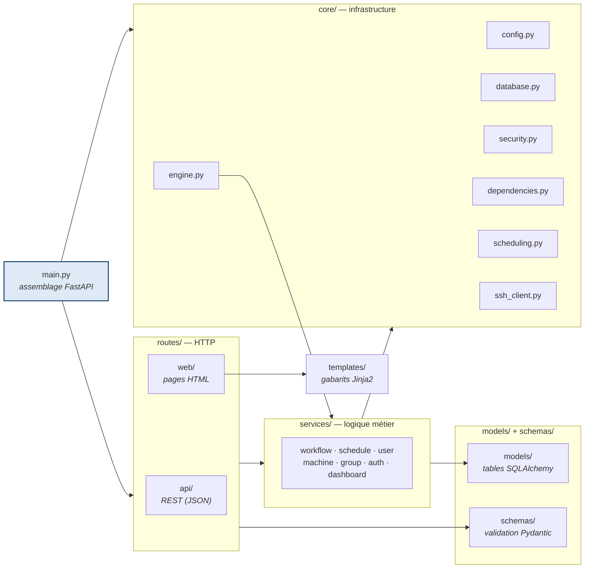
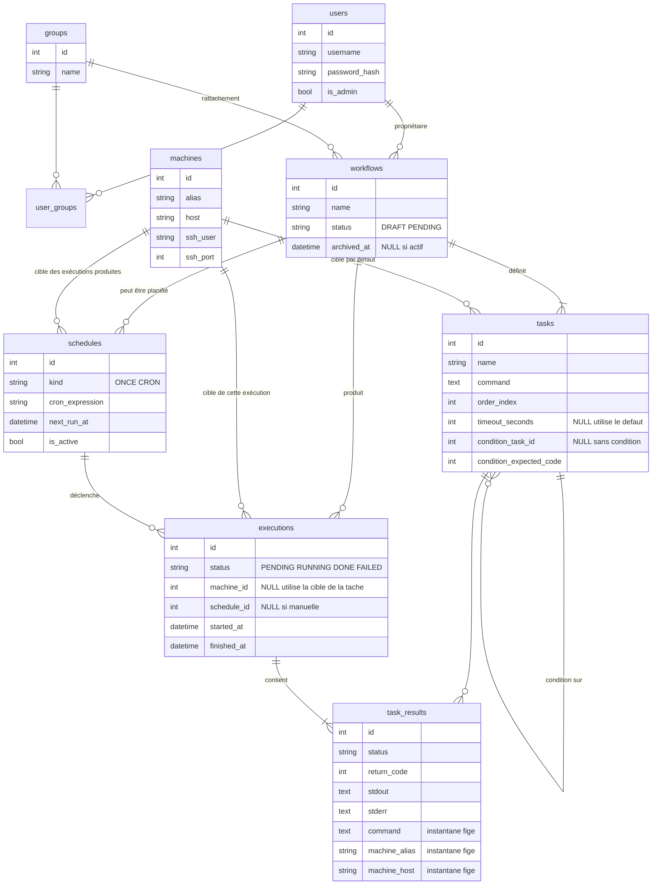
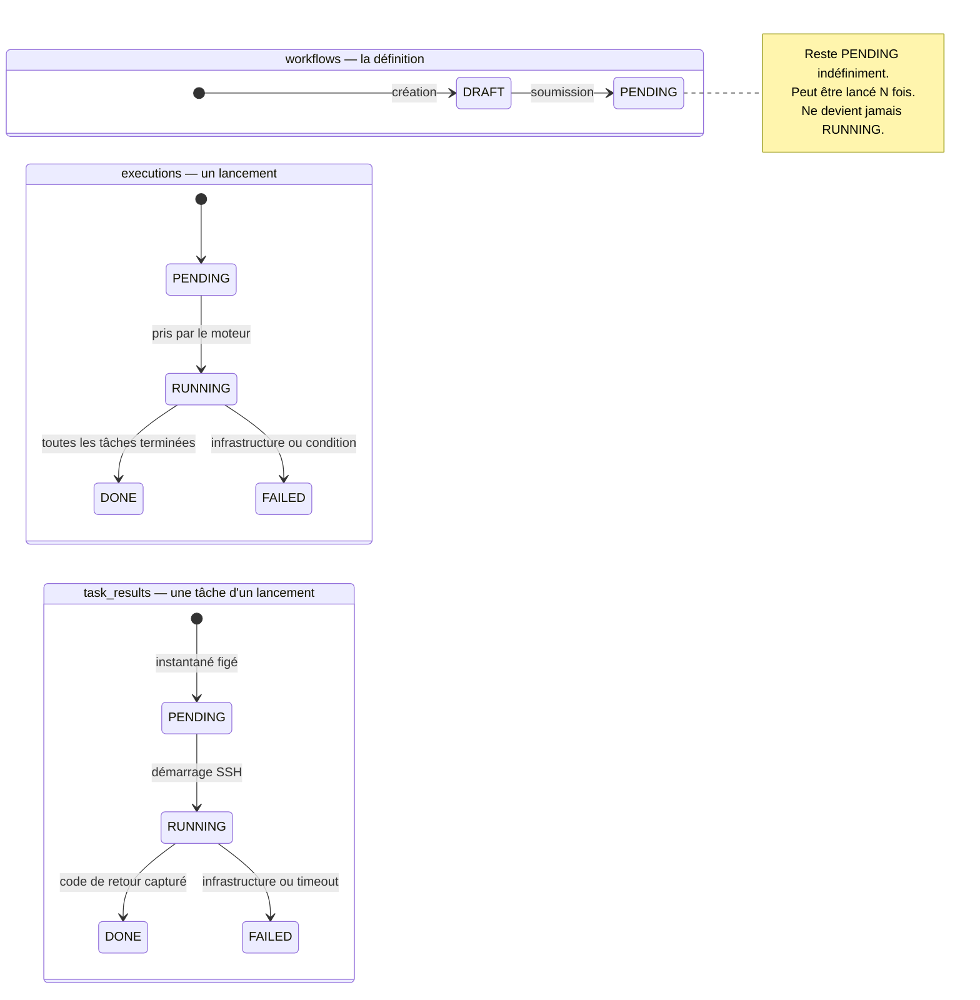
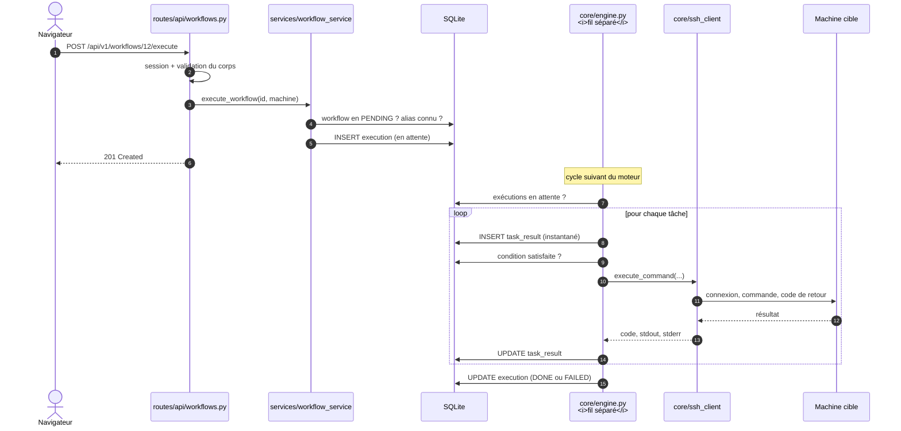

# Architecture

Description technique de l'application telle qu'elle est implémentée. Pour
l'installer et l'exploiter, voir [README](README.md) ; pour y contribuer, voir
[MAINTENANCE](MAINTENANCE.md).

---

## Vue d'ensemble

Un seul processus, un seul conteneur. FastAPI sert à la fois l'API REST et les
pages web (rendu serveur via Jinja2). Le moteur d'ordonnancement tourne dans le
même processus, sur un fil d'exécution séparé.

| Composant | Choix | Raison |
|---|---|---|
| Langage, framework | Python 3.12, FastAPI | Adapté au scripting système, asynchronisme natif |
| Base de données | SQLite | Quelques workflows par jour : un SGBD réseau serait un composant à administrer sans bénéfice |
| ORM | SQLAlchemy 2.x | — |
| Client SSH | paramiko | Pilotage programmatique de sessions SSH |
| Pages web | Jinja2, rendu serveur | Voir [Rafraîchissement](#rafraîchissement-des-pages) |
| Planification | croniter | Calcul d'occurrences uniquement, pas d'ordonnanceur concurrent |
| Exécution | Docker | Portabilité poste ↔ serveurs |

---

## Découpage en couches

### Rôle de chaque dossier

**`core/`** — l'infrastructure, sans lien avec une fonctionnalité métier
particulière.

| Fichier | Contenu |
|---|---|
| `config.py` | Lecture des variables `TASKINS_*` via pydantic-settings. Seule porte d'entrée de la configuration. |
| `database.py` | Connexion SQLite, session SQLAlchemy, `PRAGMA foreign_keys = ON`, création du schéma et amorçage au premier démarrage. |
| `security.py` | Hachage et vérification des mots de passe (bcrypt). |
| `dependencies.py` | Dépendances FastAPI de session et de rôle (`require_user_api`, `require_admin_web`…). |
| `templates.py` | Instance Jinja2 partagée. |
| `scheduling.py` | Conversions de fuseau, calcul des occurrences cron. |
| `ssh_client.py` | Enveloppe paramiko : connexion, exécution, surveillance du délai, fermeture. |
| `engine.py` | Boucle du moteur d'ordonnancement. |

**`models/`** — une table par fichier. Colonnes, contraintes, relations. Aucune
logique.

**`schemas/`** — schémas Pydantic. Valident ce qui entre par HTTP, formatent ce
qui sort. Ne touchent pas la base.

**`services/`** — la logique métier. Toute règle — « seul un workflow validé
peut être exécuté », « on ne supprime pas une machine référencée » — vit ici et
nulle part ailleurs.

**`routes/`** — le seul endroit qui parle HTTP, séparé en `api/` (REST) et
`web/` (pages HTML). Les routes valident l'entrée, appellent un service,
formatent la sortie. **Aucune règle métier dans `routes/`** : c'est ce qui
permettrait d'ajouter une autre interface (CLI, bot) sans toucher aux services.

**`templates/`** — gabarits Jinja2. Les fichiers préfixés `_` sont des fragments
inclus dans les pages complètes *et* rechargés seuls par le rafraîchissement.

---

## Modèle de données

### Les trois cycles de vie

Trois machines à états portées par trois tables différentes. **Les confondre est
l'erreur la plus probable à la reprise du code.**

**Distinction fondamentale** : un `task_result` en `DONE` avec un code de retour
non nul **n'est pas un échec**. La commande a tourné jusqu'au bout et son
résultat est capturé — une condition peut porter dessus. `FAILED` désigne
exclusivement un problème d'infrastructure : machine injoignable,
authentification refusée, délai dépassé. Cette distinction conditionne tout le
mécanisme des conditions entre tâches.

La table `tasks` ne porte aucun statut : elle décrit une définition, réutilisée à
l'identique à chaque exécution.

---

## Le moteur d'ordonnancement

Tâche de fond lancée au démarrage de l'application (`lifespan` FastAPI), qui
s'exécute à intervalle régulier. Chaque cycle procède en deux temps :

1. **Matérialiser** les planifications échues en lignes `executions` en attente.
2. **Traiter** toutes les exécutions en attente, tâche par tâche, dans l'ordre.

Cet ordre garantit qu'une occurrence échue part dès le cycle courant.

Le travail effectif est déporté via `asyncio.to_thread()`. SQLAlchemy en mode
synchrone et paramiko sont bloquants : exécuter le moteur directement dans la
boucle asyncio gèlerait le serveur web — y compris les requêtes des autres
utilisateurs — pendant chaque connexion SSH.

Chaque cycle est protégé par un `try/except` : une exception sur une exécution
ne tue pas la boucle.

### Traitement d'une exécution

Pour chaque tâche, dans l'ordre de `order_index` :

1. Résoudre la machine — celle de l'exécution si elle est renseignée, sinon
   celle de la tâche.
2. Créer le `task_result` en y **figeant** la commande et la machine.
3. Si la tâche porte une condition, lire le `return_code` de la tâche référencée
   **dans cette exécution précise** (jamais une recherche globale). Si le code ne
   correspond pas, l'exécution passe en `FAILED` et s'arrête.
4. Exécuter la commande via `ssh_client`.
5. Un échec d'infrastructure fait passer le résultat *et* l'exécution en
   `FAILED`, et interrompt le traitement.

---

## Communication SSH

Aucun agent permanent n'est déployé sur les machines cibles. Pour chaque tâche,
le serveur ouvre une connexion, exécute la commande, capture le code de retour et
les sorties, puis referme immédiatement.

Le délai maximal n'a pas pu être délégué à paramiko : `recv_exit_status()` est
bloquant et ignore tout timeout. La boucle scrute la fin de commande **et vide
les tampons à chaque tour** — sans quoi une commande verbeuse sature le buffer du
canal, le processus distant bloque en écriture, et l'attente ne se termine
jamais.

`SSHTimeoutError` hérite de `SSHInfrastructureError` : le moteur l'intercepte
sans code supplémentaire.

---

## Flux d'une requête

---

## Rafraîchissement des pages

Le navigateur interroge une route de fragment toutes les cinq secondes ; le
serveur rend le `<tbody>` seul, que le JavaScript substitue en place. Le
défilement et les blocs de sortie dépliés sont préservés. L'interrogation
s'arrête d'elle-même quand plus rien n'est en cours, et se suspend quand l'onglet
passe en arrière-plan.

Le fragment est **rendu par le serveur**, pas reconstruit en JavaScript : le
balisage des lignes n'existe donc qu'à un seul endroit, et les lignes qui
apparaissent — une tâche qui démarre, une exécution déclenchée par une
planification — arrivent sans code supplémentaire.

Un framework JavaScript a été écarté : les pages sont des tableaux, pas une
application interactive, et une chaîne de construction npm poserait problème
derrière un proxy d'entreprise. WebSocket a été écarté aussi : bidirectionnel
alors que le client n'envoie rien, et l'upgrade HTTP est parfois filtré. Passer à
SSE plus tard ne changerait pas l'architecture — mêmes routes, seul le transport
diffère.

**Piège associé** : la page complète et la route de fragment rendent le même
gabarit. L'état qu'il consomme doit être calculé par **une seule fonction**
(`_should_poll_executions`, `_should_poll_home`). Un calcul dupliqué, absent d'un
côté, casse le rafraîchissement silencieusement — Jinja évalue une variable
manquante comme fausse sans lever d'erreur.

---

## Décisions structurantes

| Décision | Raison |
|---|---|
| **Pas d'agent permanent** sur les machines cibles | Une connexion SSH à la demande rend le même service, sans rien à déployer ni superviser sur chaque serveur. |
| **API en JSON structuré** plutôt qu'en YAML | Le YAML imposerait une étape d'analyse au cœur de l'API. Le JSON est validé directement par Pydantic. Les règles de validation prévues pour le YAML sont conservées. |
| **La machine cible appartient à l'exécution**, pas à la tâche | Permet de rejouer un workflow validé ailleurs sans toucher à sa définition, qui reste immuable. Place aussi le futur contrôle « cet utilisateur peut-il exécuter sur cette machine ? » au bon endroit. |
| **Commande et machine recopiées** dans `task_results` | Sans cette copie, l'historique mentirait : une exécution redirigée afficherait la machine par défaut, et modifier une définition réécrirait rétroactivement ce qui s'est produit. |
| **Moteur dans un fil séparé** | SQLAlchemy et paramiko sont bloquants. |
| **Différé et récurrence dans une seule table** | Une planification ne fait que créer des exécutions ; le traitement reste celui déjà en place. |
| **Aucun rattrapage** des occurrences manquées | Après un arrêt, rejouer plusieurs occurrences en rafale ferait plus de dégâts que d'en ignorer. |
| **Fragments rendus côté serveur** | Un seul endroit décrit le balisage. |
| **Suppression refusée** si l'objet est référencé | Supprimer une machine utilisée par une tâche casserait la définition d'un workflow validé. |
| **Archivage distinct de la suppression** | L'un conserve l'historique et est réversible, l'autre efface tout. Les deux sont proposés explicitement. |

### Immuabilité des définitions

Un workflow validé n'est plus modifiable. Ce n'est pas une fonctionnalité
manquante mais une conséquence du modèle : ce qui change entre deux exécutions —
machine cible, planification — n'appartient pas à la définition. Modifier une
planification revient à éditer une ligne de `schedules`, pas le workflow.
L'historique reste donc fidèle sans qu'aucune règle applicative n'ait à le
garantir.
