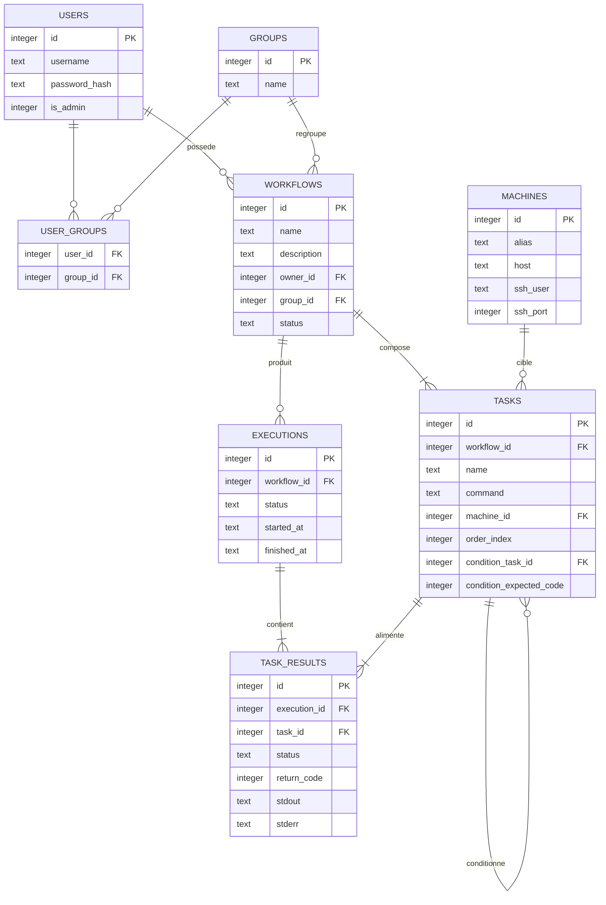

# Taskins — Modèle de données

## Vue d'ensemble

Le schéma complet (DDL exécutable) se trouve dans `02-schema.sql`. Ce document explique les entités, leurs relations, et la séparation entre les trois machines à états du système — point qui a fait l'objet d'une correction lors de la compilation des livrables (voir `00-index.md`).

## Diagramme entité-relation

## Trois machines à états distinctes

Le système comporte trois cycles de vie indépendants, chacun porté par une table différente. Les confondre est l'erreur la plus probable lors de l'implémentation.

**`workflows.status`** — cycle de conception et d'approbation d'un workflow. Valeurs : `DRAFT`, `PENDING_APPROVAL`, `PENDING`. Une fois `PENDING` (approuvé), un workflow reste dans cet état indéfiniment : il est prêt à être exécuté, autant de fois que nécessaire. Il ne devient jamais `RUNNING`, `DONE` ou `FAILED` — ces états appartiennent à une exécution précise, pas à la définition du workflow.

**`executions.status`** — cycle de vie d'une exécution individuelle. Valeurs : `PENDING`, `RUNNING`, `DONE`, `FAILED`. Une ligne est créée à chaque fois qu'un workflow approuvé est lancé (F4). C'est cette table que le moteur scanne en boucle.

**`task_results.status`** — cycle de vie d'une tâche au sein d'une exécution précise. Valeurs : `PENDING`, `RUNNING`, `DONE`, `FAILED`. `DONE` signifie que la commande a tourné jusqu'au bout et que son code de retour est capturé, même si ce code est non nul. `FAILED` signifie un échec d'infrastructure (connexion SSH impossible, timeout, machine injoignable), pas un mauvais code de retour. Détail de cette distinction et de son interaction avec le mécanisme de conditions dans `05-moteur-ordonnancement.md`.

La table `tasks`, elle, ne porte aucun statut : elle décrit la définition d'une tâche (commande, machine cible, position dans la séquence, condition éventuelle), réutilisée à l'identique à chaque exécution.

## Mécanisme de conditions — référence rapide

Une tâche peut référencer une tâche précédente du même workflow (`condition_task_id`) et un code de retour attendu (`condition_expected_code`). Au moment de l'exécution, le moteur compare ce code attendu au `return_code` réellement obtenu par la tâche référencée **dans la même exécution** (recherche dans `task_results` filtrée par `execution_id` et `task_id`, jamais une recherche globale). Logique complète dans `05-moteur-ordonnancement.md`.

## Contrainte non exprimable en SQL

`condition_task_id` doit référencer une tâche dont le `order_index` est strictement inférieur à celui de la tâche courante, dans le même workflow. SQLite ne permet pas d'exprimer cette comparaison inter-lignes dans une contrainte `CHECK` : elle doit être validée par la couche applicative à la création ou la modification d'un workflow.

## Visibilité et groupes

Voir `06-controle-acces.md` pour le statut V1 (non appliqué) des tables `groups` et `user_groups`.
